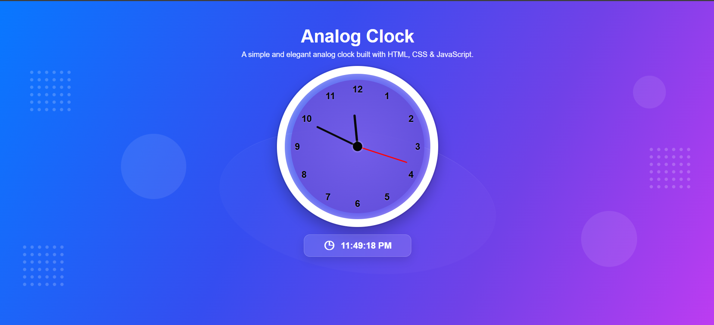

# ⏰ Analog Clock

A simple and elegant **Analog Clock** built using **HTML, CSS, and JavaScript**.

The project displays a real-time analog clock with hour, minute, and second hands, along with a digital time display. It also includes a modern responsive UI with a gradient background, decorative elements.

---

## 🌐 Live Demo

🔗 **Live Demo:** https://ravi-kumar-joshi.github.io/analog-clock-/

---

## 📸 Preview



---

## ✨ Features

- ⏰ Real-time analog clock
- 🕐 Hour, minute, and second hands
- 🖥️ Live digital time display
- 🌎 AM/PM time format
- 🎨 Modern blue-to-purple gradient UI
- 🧭 Responsive navigation bar
- 📱 Fully responsive design
- ✨ Decorative background elements
- ⚡ Lightweight and fast
- 🚫 No external frameworks required

---

## 🛠️ Technologies Used

### HTML5

Used to create the structure of the webpage, including:

- Clock structure
- Clock numbers
- Clock hands
- Digital clock

### CSS3

Used for styling and creating the modern interface:

- CSS Gradients
- Flexbox
- CSS Grid
- Border Radius
- Box Shadows
- Responsive Media Queries
- Backdrop Effects
- Decorative Elements

### JavaScript

Used to make the clock functional:

- Gets the current system time
- Calculates clock-hand rotation
- Updates the analog clock every second
- Updates the digital clock
- Handles AM/PM formatting

---

## 📂 Project Structure

```text
analog-clock/
│
├── index.html
├── style.css
├── script.js
├── preview.png
└── README.md